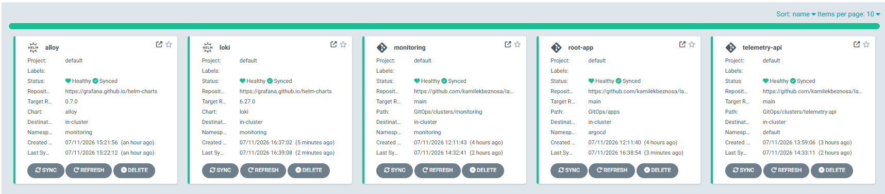
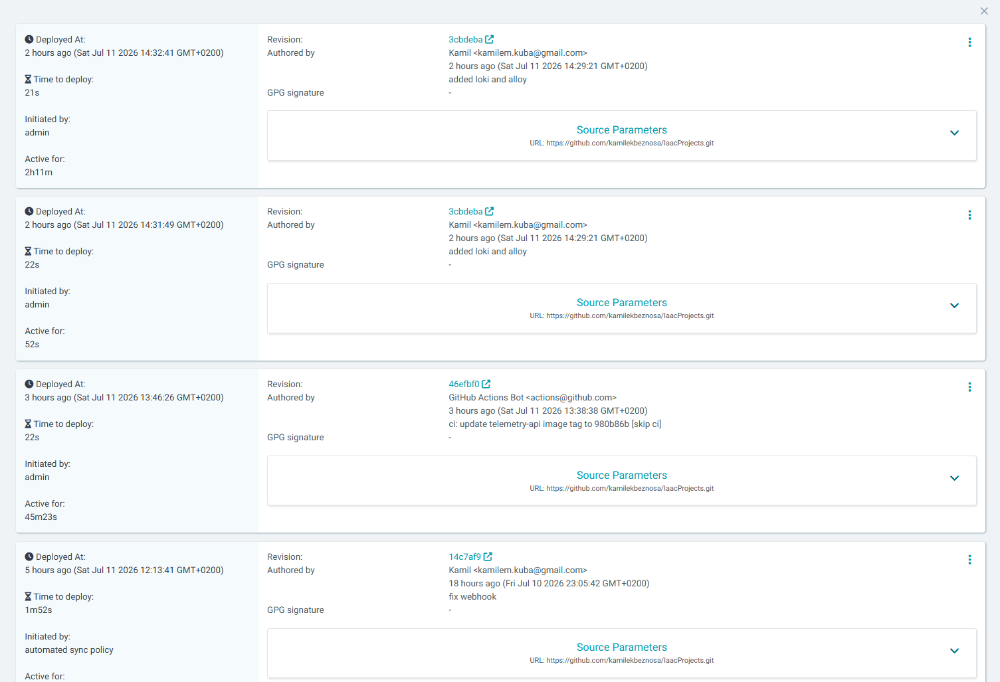
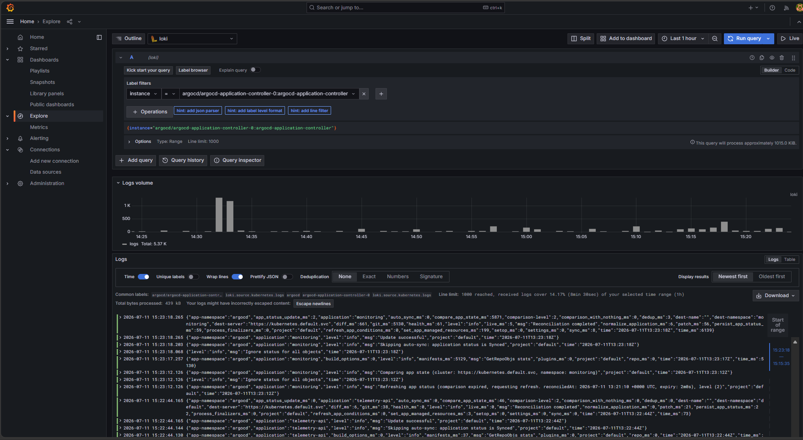
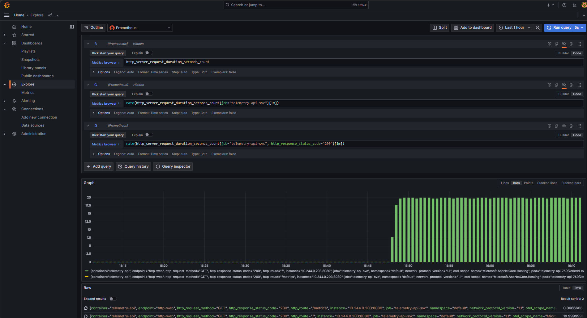
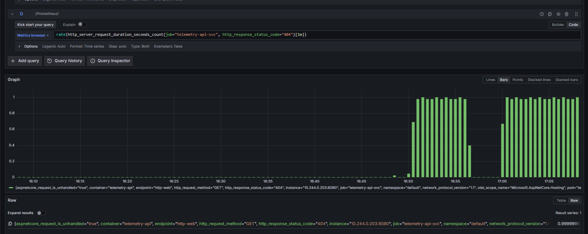
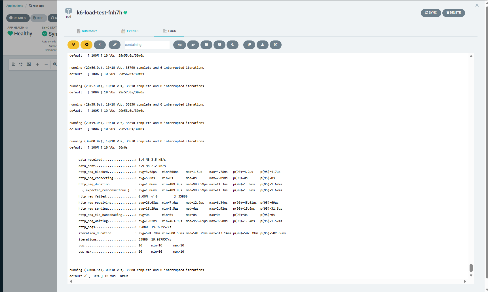
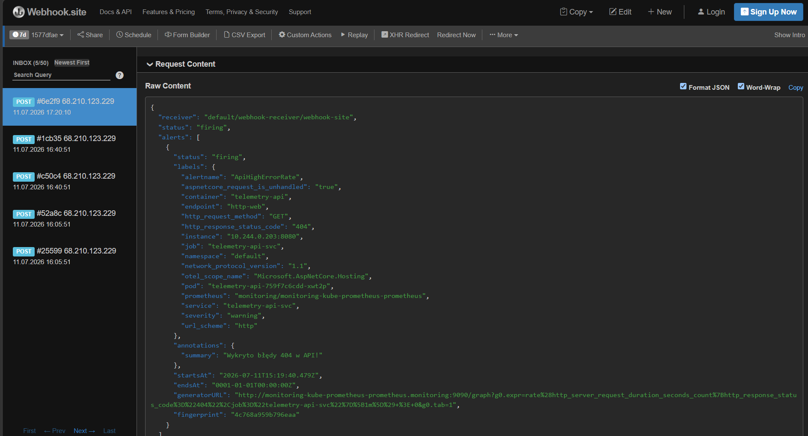
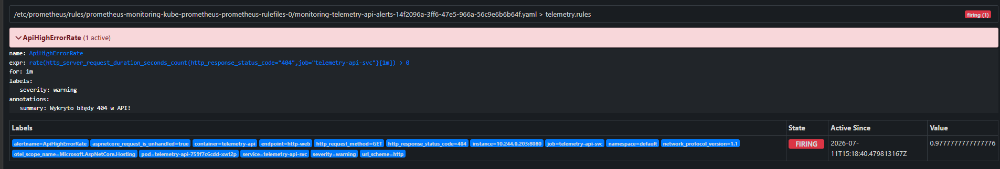
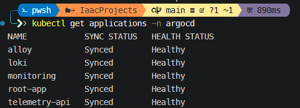

# Kubernetes Observability & GitOps Platform

An enterprise-style, fully declarative observability platform built on Kubernetes. This project demonstrates end-to-end **GitOps** with **ArgoCD**, a modern observability stack (logs, metrics, alerts), a custom instrumented **C# .NET 8 Web API**, automated load generation, and documented incident-simulation workflows for rapid **root cause analysis (RCA)**.

The cluster state is the single source of truth in Git — no manual `kubectl apply`, no portal drift. Designed for **Azure Kubernetes Service (AKS)** or local clusters (**k3d** / **kind**).

> **Portfolio context:** This is Project 1 in my DevOps portfolio monorepo. Future projects  will live alongside it under the same repository.

---

## Table of Contents

- [Architecture](#architecture)
- [Tech Stack](#tech-stack)
- [Repository Structure](#repository-structure)
- [Core Capabilities](#core-capabilities)
- [Incident Simulation & RCA Runbook](#incident-simulation--rca-runbook)
- [Prerequisites](#prerequisites)
- [Quick Start](#quick-start)
- [What I Learned](#what-i-learned)
- [Skills Demonstrated](#skills-demonstrated)

---

## Architecture

The platform follows the **App of Apps** GitOps pattern. ArgoCD continuously reconciles the cluster against the `GitOps/apps/` directory on GitHub — if a resource is removed from Git, it is removed from the cluster.

```text
┌─────────────┐     watches      ┌──────────────┐     syncs      ┌─────────────────────────────┐
│   GitHub    │ ───────────────► │   ArgoCD     │ ────────────► │  Kubernetes Cluster         │
│  (GitOps/)  │                  │  (root-app)  │               │                             │
└─────────────┘                  └──────────────┘               │  ┌─────────────────────┐  │
                                                                 │  │ telemetry-api (.NET) │  │
                                                                 │  │  /metrics endpoint   │  │
                                                                 │  └──────────┬──────────┘  │
                                                                 │             │ scrape       │
                                                                 │  ┌──────────▼──────────┐  │
                                                                 │  │ Prometheus + Grafana │  │
                                                                 │  │ (kube-prom-stack)    │  │
                                                                 │  └──────────┬──────────┘  │
                                                                 │             │ rules        │
                                                                 │  ┌──────────▼──────────┐  │
                                                                 │  │   Alertmanager      │──┼──► Webhook (Discord / Slack / Telegram)
                                                                 │  └─────────────────────┘  │
                                                                 │                             │
                                                                 │  ┌─────────┐   logs   ┌────┐│
                                                                 │  │  Alloy  │ ───────► │Loki││
                                                                 │  └────▲────┘          └────┘│
                                                                 │       │ pod discovery       │
                                                                 │  ┌────┴────┐                │
                                                                 │  │ k6 Job  │ ──traffic──► API│
                                                                 │  └─────────┘                │
                                                                 └─────────────────────────────┘
```

---

## Tech Stack

| Layer | Technology | Role |
|---|---|---|
| **GitOps** | ArgoCD | Declarative sync, App of Apps, automated reconciliation |
| **Metrics** | Prometheus, Grafana | `kube-prometheus-stack`, ServiceMonitor scraping, dashboards |
| **Logs** | Grafana Loki, Grafana Alloy | Log aggregation; Alloy discovers pods and forwards stdout with labels |
| **Application** | C# .NET 8 Web API | `telemetry-api` — native `/metrics` exposition for Prometheus |
| **Load testing** | k6 | Kubernetes `Job` simulating concurrent users against in-cluster service |
| **Alerting** | Alertmanager, PrometheusRule | Real-time rule evaluation, webhook notifications on threshold breach |
| **Packaging** | Helm | All platform components deployed as Helm releases via ArgoCD |
| **Runtime** | Kubernetes (AKS / k3d / kind) | Target cluster |

---

## Repository Structure

```text
GitOps/
├── apps/                       # ArgoCD Application manifests (App of Apps layer)
│   ├── alert-receiver.yaml     # Alertmanager webhook routing
│   ├── alert-rule.yaml         # PrometheusRule — e.g. high API error rate
│   ├── alloy.yaml              # Grafana Alloy collector (log pipeline)
│   ├── k6-job.yaml             # k6 load-test Job
│   ├── loki.yaml               # Grafana Loki (SingleBinary mode)
│   ├── monitoring.yaml         # kube-prometheus-stack
│   └── telemetry-api.yaml      # .NET telemetry API deployment
├── bootstrap/
│   └── root-app.yaml           # Root ArgoCD Application — entry point for the cluster
├── clusters/                   # Helm values, overlays, raw manifests per component
│   ├── loki/
│   ├── monitoring/
│   └── telemetry-api/
├── img/                        # Screenshots and diagrams for documentation
└── src/
    ├── Telemetry-Api/          # C# .NET 8 Web API with native metrics
    └── k6/                     # k6 load-test scripts (JavaScript)
```

---

## Core Capabilities

### 1. GitOps Continuous Delivery (ArgoCD)

Bootstrapped with a single `bootstrap/root-app.yaml`. ArgoCD watches `GitOps/apps/` and automatically syncs every Application — no manual cluster changes.

Key decisions:
- **App of Apps** — one root Application manages all child Applications.
- **Explicit `targetRevision`** on Helm charts — reproducible, version-pinned deployments.
- **Declarative enforcement** — resources removed from Git are pruned from the cluster.


*ArgoCD dashboard showing all Applications in `Healthy` / `Synced` state.*



---

### 2. Log Aggregation (Loki + Alloy)

**Loki** runs in **SingleBinary** mode with a test `schemaConfig` — required because the upstream Helm chart defaults to a distributed topology unsuitable for small clusters. Values and startup flags are overridden at the ArgoCD Application level via `parameters` and `helm.values`.

**Grafana Alloy** acts as the log collector:
- Discovers pods in the cluster automatically.
- Relabels streams with `namespace`, `pod`, and `app` labels.
- Forwards structured stdout logs to Loki.


*Query example: `{namespace="default", app="telemetry-api"}`*

---

### 3. Metrics & Dashboards (Prometheus + Grafana)

The **telemetry-api** exposes Prometheus-compatible metrics (e.g. `http_server_request_duration_seconds_count`). A **ServiceMonitor** tells Prometheus to scrape the API automatically.

**Grafana dashboards** visualize the four **Golden Signals**:
- **Latency** — request duration percentiles
- **Traffic** — requests per second (RPS)
- **Errors** — HTTP 4xx / 5xx rate
- **Saturation** — CPU / memory pressure on pods

PromQL example used in dashboards:

```promql
rate(http_server_request_duration_seconds_count{job="telemetry-api"}[1m])
```


*Dashboard during k6 load test — note the RPS spike and latency graph.*



---

### 4. Load Generation (k6)

A **k6 Job** runs inside the cluster and hits the in-cluster service `telemetry-api-svc` with **10 virtual users**, generating real traffic for dashboards and alert evaluation.

```text
k6 Job  →  telemetry-api-svc:8080  →  /metrics scraped by Prometheus  →  Grafana
```



---

### 5. Alerting (Alertmanager + Webhook)

A **PrometheusRule** (`ApiHighErrorRate`) evaluates error rates in real time. When the threshold is breached for more than one minute, **Alertmanager** fires and sends a JSON payload to an external **Webhook** (Discord, Telegram, Slack, or [webhook.site](https://webhook.site) for testing).


*Alert payload with `"status": "firing"` — confirms end-to-end alert pipeline.*



---

## Incident Simulation & RCA Runbook

This platform is designed not only to collect telemetry but to **detect failures, notify on-call, and guide investigation**. Below is a documented simulation workflow.

### Scenario: High API Error Rate

| Step | Action | Expected outcome |
|---|---|---|
| **1. Baseline** | k6 Job generates steady traffic (~20 RPS) | Grafana shows stable latency and low error rate |
| **2. Fault injection** | Route traffic to a non-existent endpoint or overload CPU | API returns HTTP 404 / 5xx errors |
| **3. Alert fires** | `ApiHighErrorRate` rule breaches threshold for >1 min | Alertmanager sends webhook notification |
| **4. Acknowledge** | Engineer opens alert link → Grafana | Golden Signals dashboard confirms error spike |
| **5. Correlate logs** | Grafana Explore → Loki: `{namespace="default", app="telemetry-api"}` | Stack traces / missing route identified |
| **6. Resolve** | Fix endpoint / scale pod / rollback via Git | ArgoCD syncs fix; metrics return to baseline |

### RCA workflow (metrics → logs → code)

```text
Alert (Webhook)  →  Grafana (metrics confirm)  →  Loki (logs pinpoint)  →  Git fix  →  ArgoCD sync
```

---

## Prerequisites

- Kubernetes cluster (AKS, k3d, or kind) with `kubectl` configured
- [ArgoCD](https://argo-cd.readthedocs.io/en/stable/getting_started/) installed in the cluster
- [Helm](https://helm.sh/) v3+
- (Optional) [Azure CLI](https://learn.microsoft.com/en-us/cli/azure/) if deploying on AKS

---

## Quick Start

### 1. Install ArgoCD

Before applying GitOps manifests, ArgoCD must be installed on the cluster:
```bash
kubectl create namespace argocd
kubectl apply -n argocd -f [https://raw.githubusercontent.com/argoproj/argo-cd/stable/manifests/install.yaml](https://raw.githubusercontent.com/argoproj/argo-cd/stable/manifests/install.yaml)
```

### 2. Bootstrap ArgoCD (root Application)

```bash
kubectl apply -f GitOps/bootstrap/root-app.yaml
```

ArgoCD will discover and sync all Applications under `GitOps/apps/`.

### 3. Verify sync status

```bash
kubectl get applications -n argocd
```

All Applications should reach `Synced` / `Healthy`.



### 4. Port-forward Grafana (local access)

```bash
kubectl port-forward svc/kube-prometheus-stack-grafana -n monitoring 3000:80
```

Open `http://localhost:3000` and import / open the Golden Signals dashboard.

### 5. Trigger a load test

```bash
kubectl apply -f GitOps/apps/k6-job.yaml
kubectl logs -f job/k6-load-test -n default
```

### 6. Simulate an incident (optional)

Modify the k6 script target URL to a non-existent path, re-apply the Job, and observe the alert pipeline end to end.

---

## What I Learned

This was not "copy-pasting YAML" — several real infrastructure problems had to be solved along the way.

| Challenge | Solution | Takeaway |
|---|---|---|
| ArgoCD Helm sync failures | Explicit `targetRevision`, structured `apps/` layout | GitOps requires version pinning and clear Application boundaries |
| Loki Helm chart complexity | Forced `SingleBinary` mode + `schemaConfig` via ArgoCD `parameters` | Production Helm charts often need aggressive value overrides for small clusters |
| Metrics not appearing in Grafana | ServiceMonitor + correct scrape labels on the .NET API | Backend instrumentation and K8s discovery must align on label conventions |
| Alert noise | `for: 1m` duration on PrometheusRule | Alert thresholds need a sustained breach window to avoid flapping |
| Firing alerts not reaching webhook | Aligned `AlertmanagerConfig` namespace with the target application (`default`) | Prometheus Operator enforces strict namespace isolation for alert routing by default |
| Full request lifecycle visibility | .NET metrics → Prometheus → PromQL `rate()` → Grafana → Loki correlation | Observability is a pipeline, not a single tool |

**Observability triad covered:**
- **Logs** — Alloy → Loki
- **Metrics** — .NET API → Prometheus → Grafana
- **Alerts** — PrometheusRule → Alertmanager → Webhook

---

## License

MIT — feel free to use this project as a reference or learning resource.
