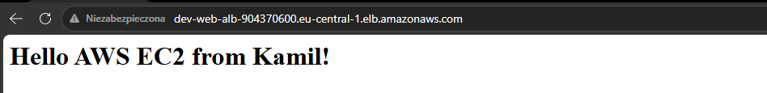
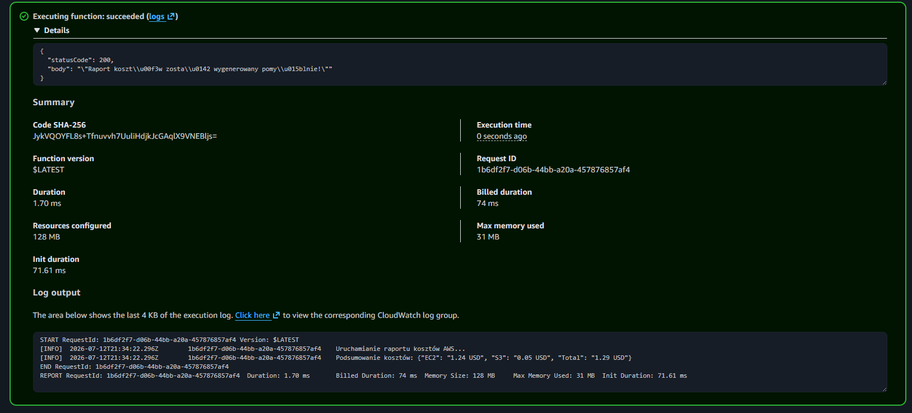

# AWS Multi-Tier Infrastructure & Serverless Automation

[](https://github.com/kamilekbeznosa/IaacProjects/actions/workflows/aws-terraform-ci.yml)


Production-ready, **multi-tier AWS infrastructure** provisioned entirely with **Terraform**. The project maps established **Azure architecture patterns** into AWS — VPC networking, load-balanced compute, object storage, and **serverless cost automation** with Lambda and EventBridge.

Part of the [IaacProjects](https://github.com/kamilekbeznosa/IaacProjects) DevOps portfolio alongside Finflow (Azure), Ansible lab, and the GitOps Observability platform.

---

## Table of Contents

- [Architecture](#architecture)
- [Azure → AWS Service Mapping](#azure--aws-service-mapping)
- [Repository Structure](#repository-structure)
- [DevSecOps & CI/CD](#devsecops--cicd)
- [Prerequisites](#prerequisites)
- [Deployment](#deployment)
- [Proof of Concept](#proof-of-concept)
- [What I Learned](#what-i-learned)
- [Skills Demonstrated](#skills-demonstrated)
- [Related Projects](#related-projects)

---

## Architecture

```text
                         Internet
                             │
                    ┌────────▼────────┐
                    │  Application    │
                    │  Load Balancer  │
                    └────────┬────────┘
                             │
              ┌──────────────┼──────────────┐
              │   Public Subnets (multi-AZ) │
              │  ┌─────────┐   ┌─────────┐  │
              │  │  EC2    │   │  EC2    │  │  ← user_data: Nginx bootstrap
              │  │ (AZ-a)  │   │ (AZ-b)  │  │
              │  └─────────┘   └─────────┘  │
              └─────────────────────────────┘
                             │
                    VPC 10.0.0.0/16
                    (IGW · Security Groups)

  ┌─────────────────┐         ┌──────────────────────────────┐
  │   S3 Bucket     │         │  EventBridge (cron schedule)  │
  │  static assets  │         │           │                   │
  └─────────────────┘         │           ▼                   │
                              │  Lambda (Python Cost Reporter) │
                              │  IAM Role · CloudWatch Logs    │
                              └──────────────────────────────┘

  Remote State: S3 (encrypted) + DynamoDB (LockID)
```

### Components

| Layer | AWS Service | Role in this project |
|---|---|---|
| **Networking** | VPC, subnets, IGW | Multi-AZ public subnets, custom `10.0.0.0/16` CIDR |
| **Compute** | EC2 (`t2.micro`, Ubuntu 22.04) | Web tier behind ALB, bootstrapped with Nginx via `user_data` |
| **Load balancing** | Application Load Balancer | Routes HTTP traffic to healthy EC2 targets |
| **Storage** | S3 | Static web assets bucket |
| **Serverless** | Lambda (Python 3.10) | Scheduled cost-reporting function (zipped artifact via Terraform) |
| **Scheduling** | EventBridge | Daily cron trigger for Lambda |
| **Security** | IAM roles/policies, Security Groups | Least privilege; stateful SG rules on EC2 and ALB |
| **State** | S3 + DynamoDB | Encrypted remote backend with state locking |

---

## Azure → AWS Service Mapping

This project demonstrates **cloud-agnostic engineering** — the same patterns used in Azure (Finflow), translated to AWS primitives:

| Concept | Microsoft Azure | Amazon Web Services | Implementation here |
|---|---|---|---|
| **Networking** | Virtual Network (VNet) | **VPC** | Custom VPC `10.0.0.0/16` |
| **Firewall** | Network Security Group (NSG) | **Security Groups** | Stateful SGs on EC2 & ALB |
| **Compute** | Virtual Machines | **EC2** | `t2.micro`, Ubuntu 22.04 LTS |
| **Load balancing** | Application Gateway | **ALB** | HTTP routing to EC2 target group |
| **Object storage** | Storage Account (Blob) | **S3** | Static assets bucket |
| **Serverless** | Azure Functions | **Lambda** | Python 3.10, deployed as zip |
| **Scheduling** | Logic Apps / Timer | **EventBridge** | Cron rule → Lambda invoke |
| **Remote state** | Storage Account + blob lease | **S3 + DynamoDB** | Encrypted bucket + `LockID` table |
| **Identity** | Managed Identity / Entra ID | **IAM Roles** | Lambda execution role, least privilege |


---

## Repository Structure

```text
aws-lab/                          # or your chosen folder name
├── bootstrap/                    # one-time: S3 state bucket + DynamoDB lock table
│   ├── main.tf
│   ├── variables.tf
│   └── outputs.tf
├── environments/
│   └── dev/                      # main stack for development
│       ├── backend.tf            # points to bootstrap outputs
│       ├── main.tf
│       ├── variables.tf
│       └── terraform.tfvars.example
├── modules/                      # optional: vpc, ec2, alb, lambda, s3
├── lambda/
│   └── cost_reporter/            # Python source → zipped by Terraform
│       └── lambda_function.py
├── img/                          # screenshots for documentation
│   ├── alb-ec2-success.png
│   └── lambda-eventbridge-success.png
└── README.md
```

---

## DevSecOps & CI/CD

Security and quality gates run in **GitHub Actions** on every push/PR (workflow: `.github/workflows/aws-ci.yml`):

| Step | Tool | Purpose |
|---|---|---|
| Format | `terraform fmt -check` | Consistent HCL style |
| Lint | **TFLint** | AWS-specific best practices and naming |
| Validate | `terraform validate` | Syntax and provider schema |
| Security | **Checkov** | SAST — missing encryption, overly permissive IAM, public exposure |

Same pipeline philosophy as [Finflow](../Project/README.md) — shift-left validation before any `terraform apply`.

---

## Prerequisites

- [Terraform](https://developer.hashicorp.com/terraform) ≥ 1.5
- [AWS CLI](https://aws.amazon.com/cli/) configured (`aws configure` or env vars)
- AWS account with permissions for VPC, EC2, ALB, S3, Lambda, EventBridge, IAM, DynamoDB
- (Optional) [Checkov](https://www.checkov.io/) and [TFLint](https://github.com/terraform-linters/tflint) locally

---

## Deployment

### 1. Bootstrap remote state (run once per account/region)

Creates the S3 bucket (encryption enabled) and DynamoDB table for state locking.

```bash
cd bootstrap
terraform init
terraform apply
```

Note the outputs — bucket name and DynamoDB table name are referenced in `environments/dev/backend.tf`.

### 2. Deploy the dev environment

```bash
cd ../environments/dev
cp terraform.tfvars.example terraform.tfvars   # edit region, names if needed
terraform init
terraform plan
terraform apply
```

### 3. Verify

- Open the **ALB DNS name** in a browser — Nginx default page (or your bootstrap content) confirms end-to-end routing.
- In AWS Console → **Lambda** → Test the cost reporter function, or wait for the EventBridge schedule and check **CloudWatch Logs**.

### 4. Destroy (avoid charges)

```bash
cd environments/dev
terraform destroy

cd ../../bootstrap
terraform destroy   # only when you no longer need the state backend
```

> Always destroy `environments/dev` first. Remove `bootstrap` last — it holds remote state for other stacks.

---

## Proof of Concept

### 1. Application Load Balancer → EC2

Traffic successfully routed through the ALB to the bootstrapped EC2 instance (Nginx via `user_data`).



### 2. EventBridge → Lambda execution

Lambda test invocation / CloudWatch logs showing the Python Cost Reporter ran successfully with correct IAM role assumption.



-->

---

## What I Learned

| Challenge | Solution | Takeaway |
|---|---|---|
| Azure → AWS mental model | Service mapping table (VNet→VPC, NSG→SG, Functions→Lambda) | Patterns transfer; service names change |
| HA web tier | ALB + EC2 in multiple AZs | Load balancer health checks replace single-VM exposure |
| Bootstrap chicken-and-egg | Separate `bootstrap/` stack for state backend | Remote state infrastructure is its own lifecycle |
| Serverless packaging | Zip Lambda in Terraform (`archive_file`) | IaC owns the full artifact pipeline |
| IAM for Lambda | Dedicated execution role with minimal policies | Least privilege is explicit in HCL, not implied |
| Cost control | Scheduled cost reporter + `terraform destroy` discipline | Automation + teardown habits prevent bill shock |

---

## Related Projects

| Project | Connection |
|---|---|
| [Finflow (Azure)](../Project/README.md) | Same multi-tier / IaC patterns — private networking on Azure, public HA web tier on AWS |
| [Python Toolkit (Scripts-collection)](https://github.com/kamilekbeznosa/Scripts-collection/tree/main/python) | `azure-cost-reporter` CLI — Lambda here is the AWS serverless equivalent |
| [Ansible Lab](../ansible-lab/README.md) | Could configure EC2 post-provision (Nginx hardening, node_exporter) — Terraform + Ansible split |
| [Observability Platform](../GitOps/README.md) | CloudWatch today; same metrics/logs mindset as Prometheus/Grafana on K8s |

---

## License

MIT — same as the parent repository.
